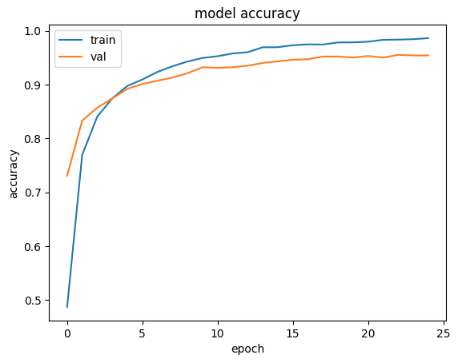
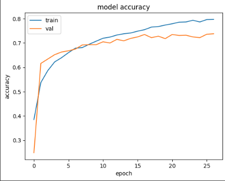
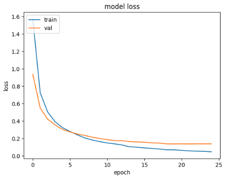
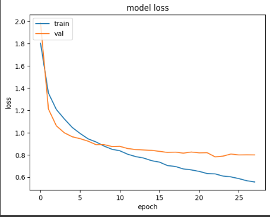

# Tomato Leaf Diseases Classification Using DenseNet121 & ResNet101

## About Our App 🍅
<p align="justify">
Healtiness of tomato is important to gardener that has started to plant tomato recently. Sometimes, they don't know how to check the healthiness of the tomato. So, we provide this app to help gardener to check the healthiness of the tomato. Just upload the image of your tomato and we will classify it for you!
<p/>

## Installation

<p align="justify">
*PDM - Latest Version <br>
Make sure you have PDM in your device first. You can follow this <a href="https://pdm-project.org/en/latest/#installation">guide<a/> to get your PDM. <br>

Run command below to create a new project
```sh
pdm init
```
<br>

Then, prepare the venv with library below, <br>

*Streamlit - 1.37.0 <br>
```sh
pdm add streamlit==1.37.0
```

*Tensorflow - 2.17.1 <br>
```sh
pdm add tensorflow==2.17.1
```

*Numpy - latest version <br>
```sh
pdm add numpy
```

*joblib - latest version <br>
```sh
pdm add joblib
```

<p/>

## About Our Model 👁️
<p align="justify">
Our model is using Convolutional Neural Network (CNN) technology to classify the healthiness of the tomato. We use pretrained model from TensorFlow called DenseNet121 and ResNet101 to make sure the accuracy of the model. The model has been trained using 11.000 images of tomato with 10 different classes from kaustubhb999 tomato leaf datasets.
<p/>

## DenseNet121 vs Resnet101 📊
<p align="justify">
DenseNet121 and ResNet101 are both pretrained model from TensorFlow that can be used for image classification. Both models have their own advantages and disadvantages. From our research, this is the performance different between DenseNet121 and ResNet101:
<p/>

<p align="center">
<a>


&nbsp &nbsp &nbsp &nbsp &nbsp


</a>
<br>
<a>


&nbsp &nbsp &nbsp &nbsp &nbsp


</a>
<p>
<br>

<p align="justify">
From the image above, we can see that DenseNet121 has better accuracy and performance than ResNet101. But, ResNet101 isn't bad either. It still need some improvement to make it better. You can try both models in our app to see the difference between them.
<p/>

## About the Dataset 📁
<p align="justify">
The dataset contains 10 classes of tomato leaf diseases and healthy leaves. The dataset contains 11.000 images of tomato leaves with 10 different classes. The dataset is divided into 10000 training and 1000 testing. The dataset classes are listed below:

1. Tomato_Mosaic_Virus
2. Target_Spot
3. Bacterial_Spot
4. Tomato_Yellow_Leaf_Curl_Virus
5. Late_Blight
6. Leaf_Mold
7. Early_Blight
8. Spider_Mites Two-Spotted Spider Mite
9. Tomato___Healthy
10. Septoria_Leaf_Spot

The dataset is available on Kaggle and you can download it by clicking <a href="https://www.kaggle.com/datasets/kaustubhb999/tomatoleaf">here<a/>.
<p/>

## Author
M Zidan Rifardi (TheMelonnn)

